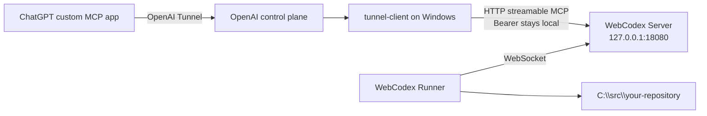
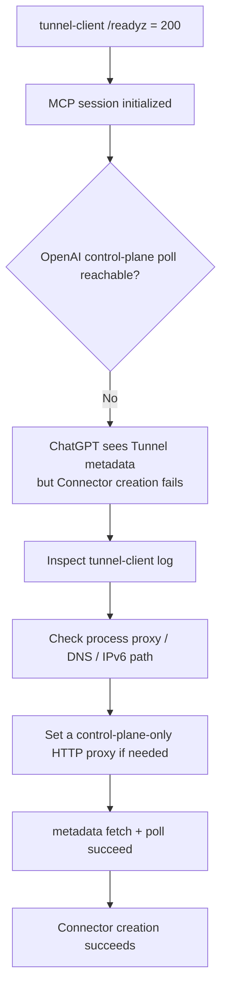

# Windows + OpenAI Secure MCP Tunnel: End-to-End Guide

[English](WINDOWS_OPENAI_TUNNEL.md) | [简体中文](WINDOWS_OPENAI_TUNNEL.zh-CN.md)

This guide covers setup, verification, and troubleshooting for an independent foreground WebCodex Server and Runner on Windows behind an OpenAI Secure MCP Tunnel.

This guide draws on the author's manual setup. The [walkthrough](#manual-walkthrough--2026-08-30) preserves the environment, actions, and troubleshooting sequence; original screenshots accompany the Connector creation steps.

## When to use this topology

If your goal is simply **normal long-lived WebCodex use**, start with the [Full Setup guide](PERSONAL_SETUP.md). This page is a Windows + OpenAI Tunnel deep dive and troubleshooting guide; continue here when you deliberately choose this private network path, need to reproduce the explicit topology, or are diagnosing Tunnel behavior.

Use this setup when the Windows machine should host the complete WebCodex runtime while keeping the Server private:

- WebCodex Server runs in the foreground on Windows;
- an independent WebCodex Runner connects to that Server;
- the Server stays loopback-only and exposes no public WebCodex port;
- ChatGPT reaches `/mcp` through an OpenAI Secure MCP Tunnel;
- the Runner can register and operate multiple local repositories exactly like a normal Runner connected to a hosted Server.

For a temporary one-repository share, prefer the simpler product path:

```powershell
webcodex share --tunnel openai
```

This document focuses on the lower-level independent Server + independent Runner topology for explicit lifecycle control and Tunnel troubleshooting on Windows.

## Architecture



Two boundaries matter:

1. ChatGPT selects **Connection: Tunnel** and never needs the local WebCodex Bearer.
2. The Runner remains a standard WebCodex Runner. The Tunnel changes only the private ChatGPT-to-MCP transport; it does not change how the Runner connects to or operates projects through WebCodex.

## 1. Prerequisites

### WebCodex

Install the current WebCodex build and make sure the CLI, Server, and Runner binaries come from the same version/commit:

```powershell
webcodex --version
webcodex-server --version
webcodex-runner --version
```

Do not debug a transport problem with a mixed CLI/Server/Runner baseline. Align all three binaries first.

### OpenAI Secure MCP Tunnel

Create or select an OpenAI Secure MCP Tunnel and configure these variables in the Windows user environment:

```text
CONTROL_PLANE_TUNNEL_ID
CONTROL_PLANE_API_KEY
```

Use a Restricted `CONTROL_PLANE_API_KEY` with only Tunnels **Read + Use** when possible.

Never print or commit the Tunnel ID, API key, WebCodex Bearer, bootstrap token, or authorization-file contents.

WebCodex uses a pinned and verified OpenAI `tunnel-client`; the implementation can also resolve it from `WEBCODEX_TUNNEL_CLIENT_BIN` or `PATH`.

## 2. Initialize a Windows foreground Server

Use dedicated env/data paths so this topology does not overwrite another WebCodex runtime:

```powershell
$envFile = Join-Path $HOME ".config\webcodex\openai-tunnel\webcodex.env"
$dataDir = Join-Path $HOME ".local\share\webcodex-openai-tunnel"

webcodex server init `
  --listen 127.0.0.1:18080 `
  --data-dir $dataDir `
  --env-file $envFile `
  --json
```

`server init` creates the Server bootstrap/admin credential in the private env file. That credential is not an MCP or Runner credential.

Keep one PowerShell terminal open for the Server:

```powershell
webcodex server run --env-file $envFile
```

Confirm that the Server is listening on loopback and exposes the local MCP endpoint:

```text
Listening on: 127.0.0.1:18080
MCP endpoint: http://localhost:18080/mcp
```

Windows currently supports the foreground Server runtime. Closing the terminal or pressing Ctrl-C ends the Server.

## 3. Pair, log in, and start an independent Runner

Open a second PowerShell terminal and create a short-lived pairing code on the Server side:

```powershell
webcodex pairing create `
  --server-url http://127.0.0.1:18080 `
  --env-file $envFile `
  --username windows-user `
  --display-name "Windows Runner" `
  --ttl-secs 600
```

Redeem the code on the Runner side. Register the repository you want to use through the Connector now, and restrict the allowed root to its real parent directory when practical:

```powershell
webcodex login http://127.0.0.1:18080 `
  --code <wc_pair_...> `
  --allowed-root C:\src `
  --project C:\src\your-repository `
  --json
```

`login --json` reports a `runner_config` path without requiring the resulting credential to be pasted into ChatGPT. Start the Runner with that config:

```powershell
webcodex runner run --config <login-reported-runner-config>
```

Check the returned config with `webcodex runner status --config <login-reported-runner-config>`. At this point the Server should see a normal independent Runner with `C:\src\your-repository` already registered. Add more projects later with the normal `webcodex project register --config ...` workflow when needed.

## 4. Validate local MCP before exposing it through the Tunnel

The `tunnel-client` MCP target is the loopback endpoint:

```text
http://127.0.0.1:18080/mcp
```

Keep the WebCodex Bearer local and inject it through a file-backed `Authorization` header. Do not paste that Bearer into ChatGPT.

Before starting the long-lived daemon, run `tunnel-client doctor`. Require it to validate the Tunnel ID, Restricted control-plane API key, local WebCodex MCP reachability, and local Bearer injection together.

The runtime arguments are conceptually:

```text
--mcp.server-url url=http://127.0.0.1:18080/mcp,channel=main
--mcp.extra-headers Authorization: file:<private-authorization-file>
--health.listen-addr 127.0.0.1:0
--health.url-file <private-health-url-file>
```

`webcodex share --tunnel openai` automates the same categories of setup, runs `doctor`, and waits for `/readyz`. Manual operation is intended for an explicit independent Server/Runner topology or deep troubleshooting.

## 5. If `/readyz` is healthy but Connector creation fails

`/readyz = 200` proves the local Tunnel/MCP side is healthy enough to answer the health probe. It does **not** prove that `tunnel-client` can fetch Tunnel metadata and maintain the OpenAI control-plane poll.

If ChatGPT still fails to create the Connector, inspect the `tunnel-client` log for metadata/poll failures. A browser being able to reach the Internet is not sufficient evidence: the `tunnel-client` process may have different proxy, DNS, or IPv6 routing.

The useful troubleshooting split is:



If the host requires an HTTP proxy, first verify that the proxy can reach `api.openai.com`, then route only the OpenAI control plane through it:

```text
--control-plane.http-proxy http://127.0.0.1:<proxy-port>
```

After changing the route, require both local readiness and healthy control-plane metadata/poll behavior before retrying Connector creation.

## 6. Create the ChatGPT Connector

In ChatGPT Developer Mode, create a custom MCP app and use:

1. any descriptive name, such as `WebCodex Windows`;
2. **Connection: Tunnel**;
3. the selected WebCodex OpenAI Tunnel;
4. **Authentication: No authentication**;
5. acknowledge the custom MCP risk notice;
6. create/scan the app tools.

Why **No authentication**? The WebCodex Bearer for the local MCP hop is already injected locally by `tunnel-client`. ChatGPT should not receive or store it.

### Illustrated creation and connection

These screenshots show the author's manual setup on 2026-08-30 using the Chinese ChatGPT interface. `tunnel-test` is an example name; interface labels and tool lists may change between versions.

Create the app: select Tunnel and No authentication, acknowledge the notice, and create it.


Click Connect in the confirmation dialog to add the app to ChatGPT.


Open the app details to check that tools loaded. The screenshot shows the then-current `apply_text_edits` description; use the tool list exposed by your current Server.


## 7. Validate end to end through the Connector

After creating the Connector, refresh the ChatGPT window if the new tools do not appear in the current conversation. Then validate the path beyond UI setup:

1. confirm the Project registered during `webcodex login --project ...` is visible;
2. select that registered Project and read a known file through the Connector;
3. if write access is intentionally enabled, use a dedicated branch/safe change and review the resulting Git diff.

The project handle returned by WebCodex is output, not setup input. Do not ask the user to invent a Runner/project runtime id.

## 8. Acceptance checklist

Do not treat “the process started” as completion. Validate every layer that matters:

| Layer | Evidence |
| --- | --- |
| Windows Server | loopback listener is active and `/mcp` is reachable |
| Runner | Runner is online and `actual_transport=websocket` |
| Local MCP | `tunnel-client` reports `mcp session initialized` |
| Tunnel health | `/readyz = 200` |
| OpenAI control plane | metadata fetch succeeds and polling does not continuously fail |
| ChatGPT | Connector is created and its tools load |
| Project | the Project registered during login is visible through the Connector |
| Read | files can be read through the new Connector |
| Write | a dedicated branch can be modified and reviewed with Git diff |

The last project/read/write checks are what prove parity with the normal hosted Server + Runner development experience.

## 9. Common mistakes

### Treating `/readyz = 200` as full Tunnel readiness

Do not. Also require healthy OpenAI control-plane metadata/poll behavior.

### Pasting the WebCodex Bearer into ChatGPT

Do not. OpenAI Secure MCP Tunnel mode uses **No authentication** in ChatGPT; the Bearer stays local.

### Assuming Windows requires WSL or a Windows Service

It does not. Foreground Server and Runner operation is supported. The tradeoff is lifecycle: closing the terminals stops the processes, and managed Windows service lifecycle is not currently provided.

### Assuming `share --tunnel openai` is unrelated to this topology

The core transport is the same: local WebCodex MCP, local Bearer injection, and OpenAI `tunnel-client`. `share` owns a temporary Server/Runner/session automatically; this guide keeps the Server and Runner explicit so they can behave like a normal long-lived topology and be diagnosed independently.

## Manual walkthrough — 2026-08-30

This case preserves the author's hands-on Windows setup, including the environment, repository read/write checks, and the steps that resolved a network failure. Versions, paths, app names, and branches describe that setup; use your own configuration and the current-version preparation above when reproducing it.

### Environment

The manual setup used:

```text
WebCodex 0.3.9
commit 1fa862829122
Runner client_id=tutorial-msi-runner
preferred/actual transport=websocket
ChatGPT app=tunnel-test
```

### Register projects and verify reads and writes

The independent Runner began with zero projects, then the Tunnel Connector registered and accessed these real Windows repositories:

```text
E:\git\petal-meadow-3d
E:\git\webcodex
```

The same Connector was used to create the documentation branch:

```text
docs/windows-openai-tunnel-guide
```

That run therefore demonstrated the complete path from ChatGPT through OpenAI Tunnel to a foreground Windows Server, an independent WebSocket Runner, real project registration, repository reads, and repository writes.

### Diagnose and resolve Connector creation failure

The first Connector-creation attempt also established an important network failure mode. Local MCP initialization and `/readyz = 200` were healthy, while the OpenAI control-plane poll failed because the Windows process did not inherit the browser's Clash route and its direct DNS/IPv6 path to `api.openai.com` was unusable. The tested Clash HTTP proxy listened on:

```text
http://127.0.0.1:7890
```

Routing only the control plane through that proxy:

```text
--control-plane.http-proxy http://127.0.0.1:7890
```

changed the Tunnel log to a healthy proxy route and successful metadata/poll state; Connector creation then succeeded. This is historical evidence for the current troubleshooting rule that browser connectivity and local `/readyz` do not prove `tunnel-client` control-plane reachability.

## Related documentation

- [Deployment](DEPLOYMENT.md)
- [MCP](MCP.md)
- [CLI](CLI.md)
- [Troubleshooting](TROUBLESHOOTING.md)
