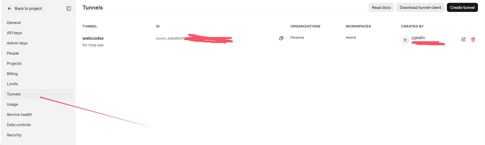
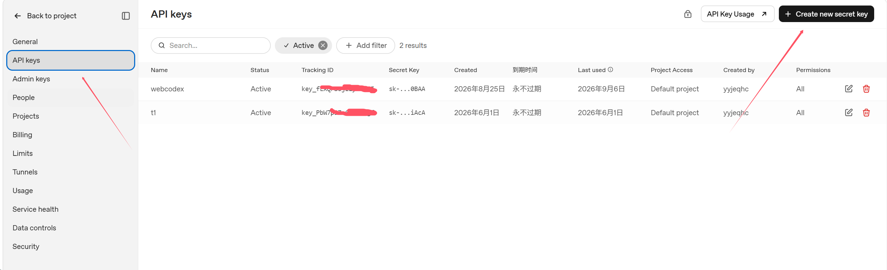
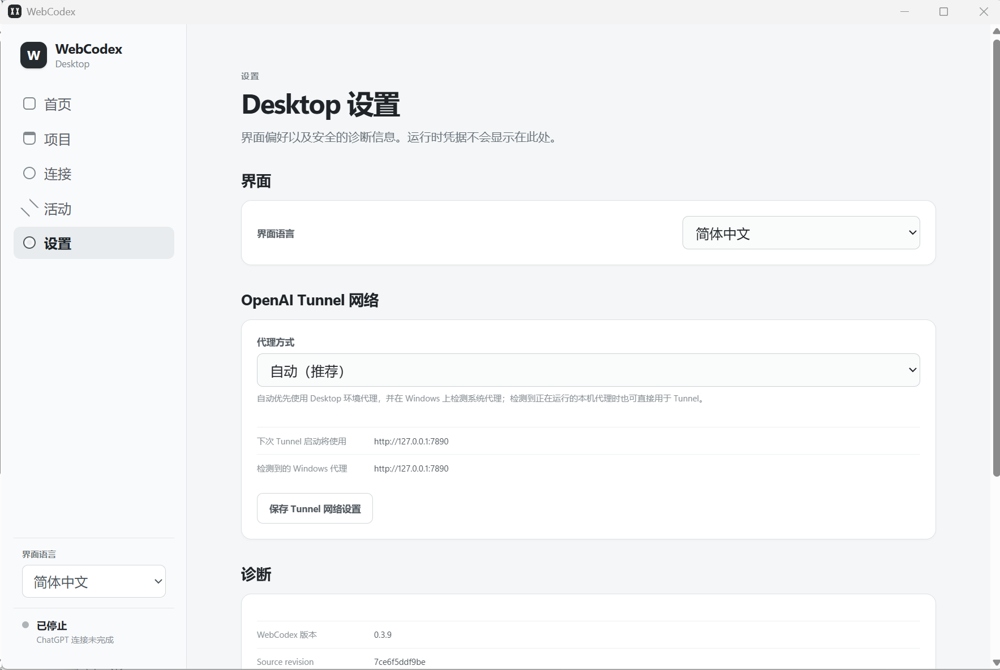
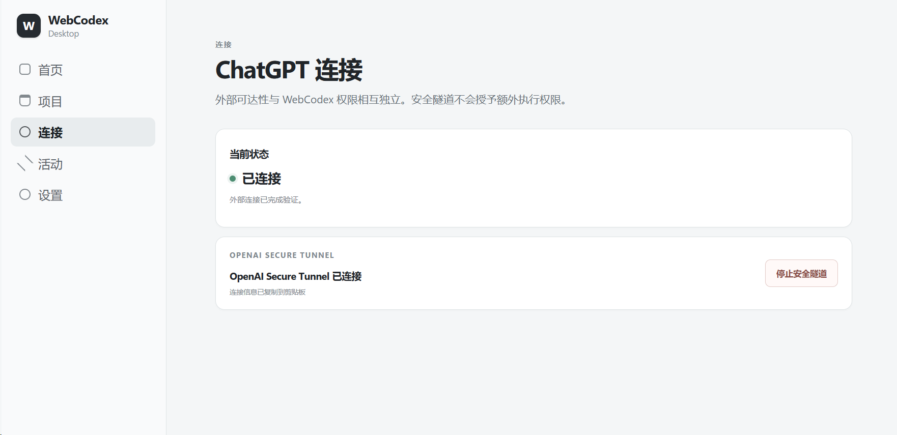
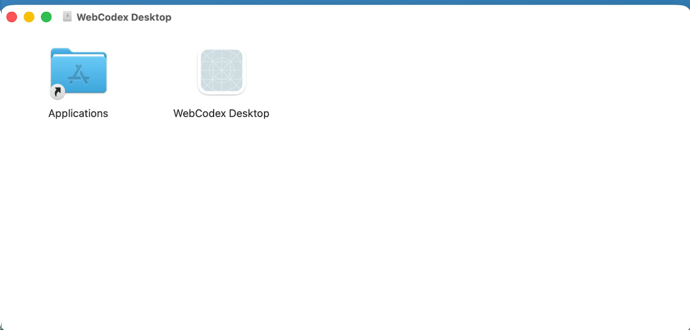
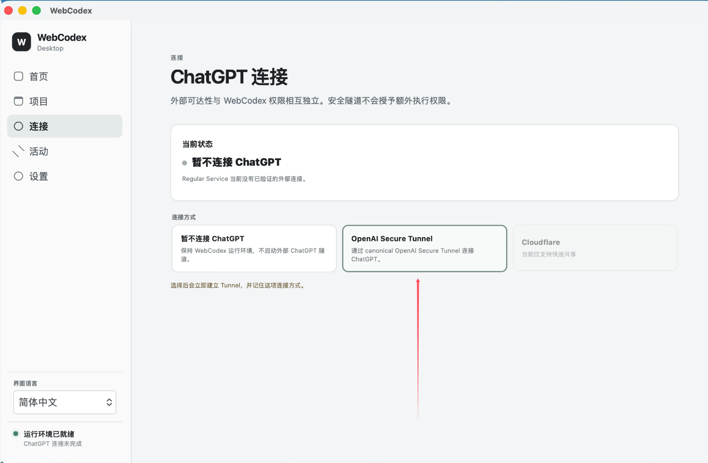
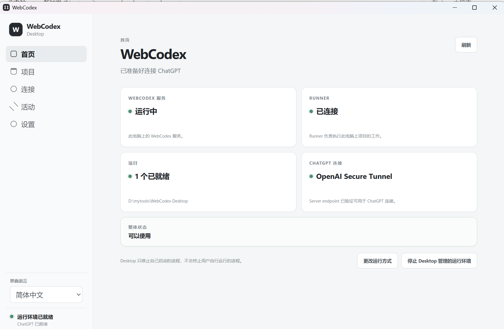
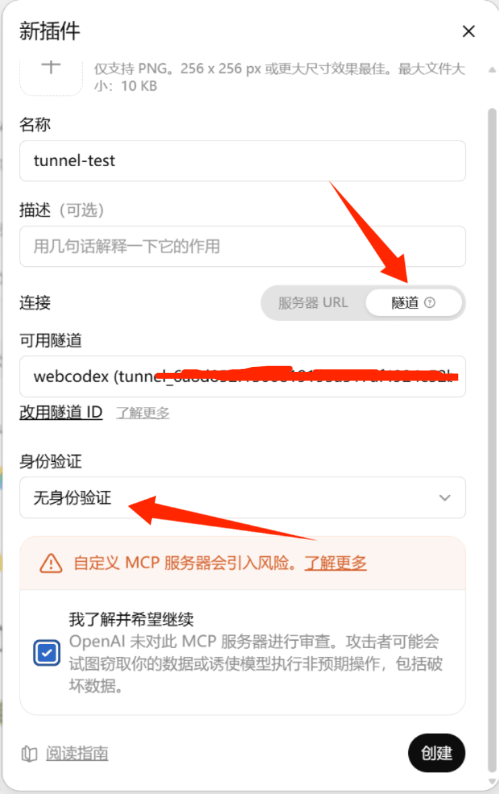
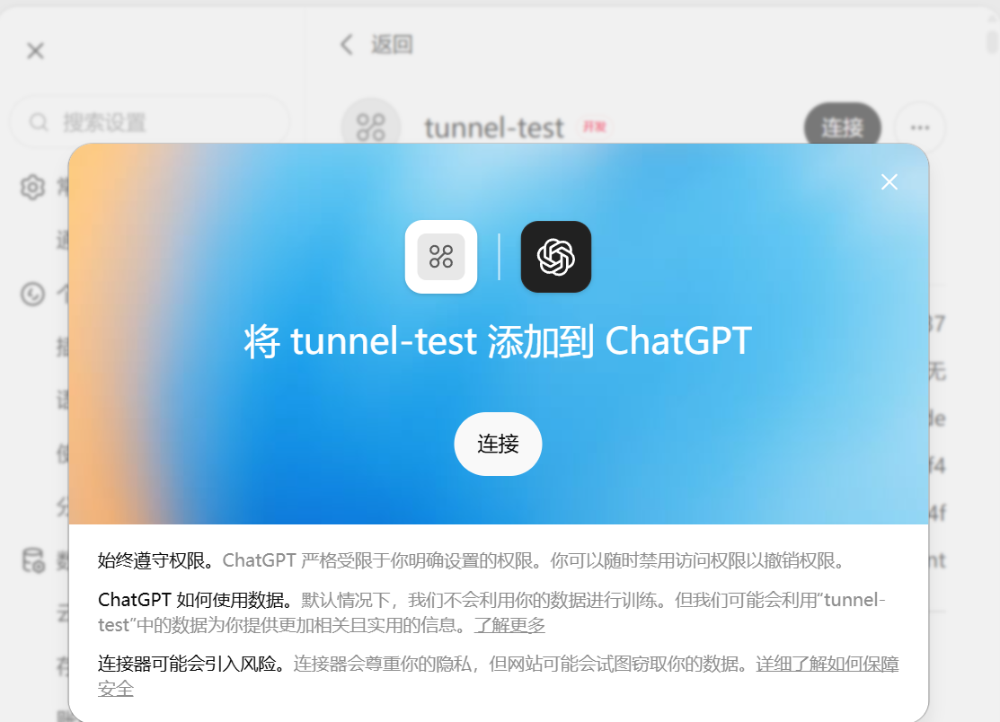
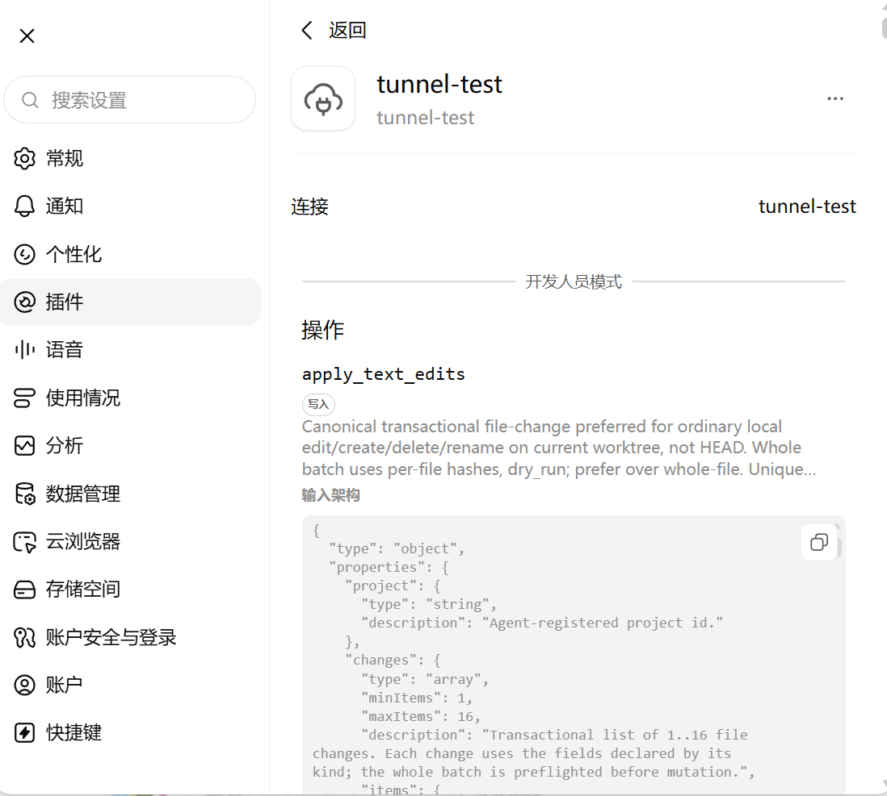

# WebCodex Desktop 快速安装与 ChatGPT 连接

[English](desktop-install.md) | [简体中文](desktop-install.zh-CN.md)

对于普通 Windows / macOS 个人用户，**最推荐的路径是 WebCodex Desktop + 官方 OpenAI Secure Tunnel**。Server 和 Runner 都留在本机，ChatGPT 通过私有 Tunnel 连接；第一次使用不需要先配置反向代理、OAuth、系统 service 或公开的 WebCodex 地址。

正常路径就是：安装 Desktop → 启动本机 Server + Runner → 启动官方 OpenAI Secure Tunnel → 在 ChatGPT 填入 Tunnel ID → 添加真正要让 AI 使用的项目。CLI、已有远程 Server、生产部署或高级网络配置再看[完整使用指南](PERSONAL_SETUP.zh-CN.md)和[部署指南](DEPLOYMENT.zh-CN.md)。

## 1. 安装 WebCodex Desktop

从 [GitHub Releases](https://github.com/yyjeqhc/webcodex/releases) 下载对应安装包：

- **Windows：**使用 Windows x64 installer。
- **macOS：**按 Mac 架构选择 Intel 或 Apple Silicon DMG。

当前 macOS 构建使用 ad-hoc 签名且没有 notarization。如果 Gatekeeper 拦截新下载构建的首次启动，进入**系统设置 → 隐私与安全 → 仍要打开**，再确认**打开**；不要全局关闭 Gatekeeper。

安装完成后启动 WebCodex Desktop。

## 2. 准备 OpenAI Tunnel

在 OpenAI 平台创建一个 Tunnel，并准备一个可用于该 Tunnel 的 API key：

- [Tunnels - OpenAI API](https://platform.openai.com/settings/organization/tunnels)
- [API keys - OpenAI API](https://platform.openai.com/settings/organization/api-keys)

Tunnel 名称可以自定义；记录自己的 Tunnel ID。API key 建议使用 Restricted key，只授予 Tunnels 所需的 **Read + Use** 权限。





不要把真实 API key、WebCodex token 或 authorization 内容提交到 Git、issue、截图或聊天记录中。

## 3. 配置 Desktop 所需环境变量

Desktop 普通 Tunnel 只需要：

```text
CONTROL_PLANE_TUNNEL_ID
CONTROL_PLANE_API_KEY
```

不需要额外配置 `OPENAI_ADMIN_KEY` 或 `OPENAI_API_KEY`。Desktop 安装包当前不把 `tunnel-client` 直接塞进安装目录；首次需要 OpenAI Secure Tunnel 时，WebCodex 会自动下载并校验固定版本，所以普通用户仍然不需要手动安装。若自动下载失败，再检查网络 / 代理，或高级用户显式设置 `WEBCODEX_TUNNEL_CLIENT_BIN`。

### Windows

建议设置为当前用户的持久环境变量，然后完全退出并重新打开 WebCodex Desktop：

```powershell
[Environment]::SetEnvironmentVariable("CONTROL_PLANE_TUNNEL_ID", "tunnel_...", "User")
[Environment]::SetEnvironmentVariable("CONTROL_PLANE_API_KEY", "<restricted-tunnel-key>", "User")
```



### macOS

下面以默认 shell 使用 zsh、变量已写入 `~/.zshrc` 为例；如果你使用其他 shell，请按实际配置调整。

从 Finder / Dock 启动的 App **不会执行 `~/.zshrc`**。仅把变量写进 `.zshrc`，Terminal 能看到，但 Desktop 不一定能看到。

临时测试可以从已经加载变量的 Terminal 启动：

```bash
source ~/.zshrc
"/Applications/WebCodex Desktop.app/Contents/MacOS/WebCodex"
```

如果希望仍从 Finder / Dock 打开，可先把当前 shell 中的值写入当前登录会话的 launchd 环境，再重新打开 Desktop：

```bash
source ~/.zshrc
launchctl setenv CONTROL_PLANE_TUNNEL_ID "$CONTROL_PLANE_TUNNEL_ID"
launchctl setenv CONTROL_PLANE_API_KEY "$CONTROL_PLANE_API_KEY"
```

如果要使用截图、窗口观察、键盘鼠标等 Computer Use 能力，还需要在 **系统设置 → 隐私与安全性** 中为实际运行 WebCodex Runner / Desktop 的进程授予 macOS 要求的权限：至少包括 **屏幕与系统音频录制（Screen Recording）**，涉及界面控制时还需要 **辅助功能（Accessibility）**。授权后通常需要重新启动相关进程才能生效；WebCodex 不会绕过或替代系统权限确认。

## 4. 启动本机运行环境并添加项目

首次启动后，Desktop 会准备本机 Server + Runner。Windows 会先把 Desktop 安装目录注册为默认项目；macOS 使用 Desktop 自己的 workspace。真正开发时，请在“项目”页面**显式添加你的代码仓库目录**。

本地配对时，Desktop 会将操作系统用户名转换为 Server 接受的名称：原本合法的名称保持不变；否则 ASCII 字母转为小写，连续的不支持字符合并为一个 `-`，名称中原有的 `-` 保持原样，去掉首尾生成的 `-`，结果限制为 64 个字符；转换后为空时使用 `desktop`。这个本地配对名称不是操作系统登录身份；重启时会复用已保存的注册身份。

这是有意的安全边界：默认项目不会自动获得其他目录或整块磁盘的访问权限。

首页优先显示整体状态与下一步操作，下方的“查看项目”“管理连接”和“查看活动”可直接进入对应页面。已有默认项目时，在项目页点击“选择其他项目”进入配置，选择运行方式和工作目录后再应用；“返回运行概览”可退出配置。没有项目时，“添加项目”进入同一流程。进入或退出配置页面本身不会修改运行环境。



## 5. 配置 Tunnel 网络

进入 **设置 → OpenAI Tunnel 网络**：

- **自动（推荐）**：优先使用 Desktop 进程继承的代理；Windows 还会检测系统代理。
- **直接连接**：不使用代理。
- **自定义 HTTP 代理**：例如 `http://127.0.0.1:7890`。

如果 Tunnel 已在运行，先停止 Tunnel，修改并保存代理设置，再重新启动 Tunnel。**不需要重启 Desktop**；每次启动 Tunnel 都会重新读取最新代理设置。





## 6. 启动官方 OpenAI Secure Tunnel

进入 **连接 → OpenAI Secure Tunnel**。运行成功后，Desktop 会显示 Tunnel 已建立，并把 Tunnel ID 复制到剪贴板（系统允许时）。



## 7. 在 ChatGPT 创建连接

在 ChatGPT 中创建自定义连接/应用时：

1. 选择 **Tunnel** 连接方式。
2. 填入刚才的 Tunnel ID。
3. **Authentication 选择 None / No authentication**。

这里不需要 OAuth。WebCodex 会在本机保存 MCP authorization credential，并由 Tunnel client 注入；ChatGPT 侧不需要看到这份本机凭据。







## 8. 最小验收

连接后可以直接让 ChatGPT 做下面几件事：

- 列出 WebCodex 项目。
- 读取一个文件。
- 在明确注册的项目中创建并再读取一个临时文件，然后删除。
- 执行 `git status`、`uname -a` / `ver` 等只读命令。
- 需要 Computer Use 时，尝试列出窗口或截取浏览器窗口。

如果这些都正常，说明 Tunnel、Server、Runner、项目权限和普通工具调用链已经打通。

## 常见问题

**OpenAI Secure Tunnel 按钮不可用**：先确认 Desktop 新进程能看到 `CONTROL_PLANE_TUNNEL_ID` 和 `CONTROL_PLANE_API_KEY`。

**macOS `.zshrc` 已配置但 Desktop 仍检测不到**：这是 Finder / Dock 启动模型导致的，按上面的 Terminal 或 `launchctl setenv` 方式处理。

**Tunnel 启动失败或连接 ChatGPT 超时**：优先检查“设置 → OpenAI Tunnel 网络”的代理；修改后停止并重新启动 Tunnel 即可。

**项目目录无法访问**：到“项目”页面显式添加对应目录，不要通过扩大默认安装目录权限来绕过项目边界。
